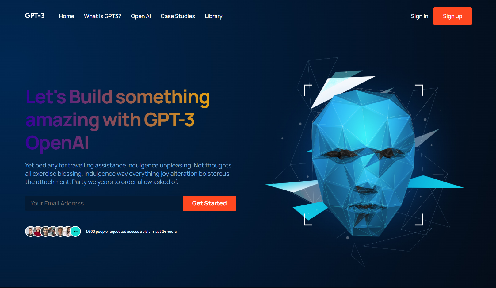

#  ChatGPT Landing page built on React

## Overview

I have created a modern, fully responsive react page for ChatGPT3. The page makes full use of reusable functional components, react file/fodler structure, and implements the CSS BEM Model for naming conventions.

The page is static, but is designed to be responsive and adaptive to different viewports.

It was made based on [an existing Figma Design](https://www.figma.com/file/lz9lLpFHMxHm2odnwM3R0z/gpt3?node-id=0%3A15&t=HzYCzHwaByNo1YRy-0) but was fully made with React. All components and responsive nav menu were created as part of this project.

### Links

 [Github Page](https://sashdc.github.io/gpt_ux_project/)

 [Github Repo](https://github.com/sashdc/gpt_ux_project)

 ## Credits

Cherian, Saharsh

[Creator Github](https://github.com/sashdc)

## License

N/A
    